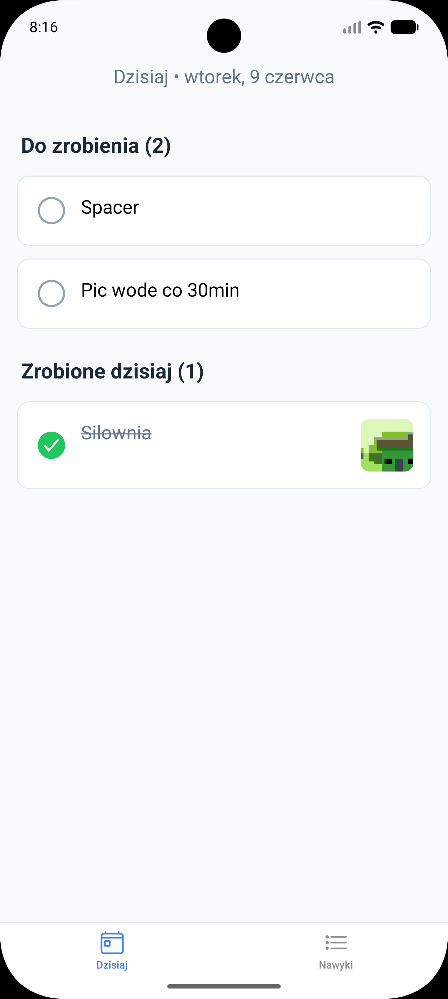
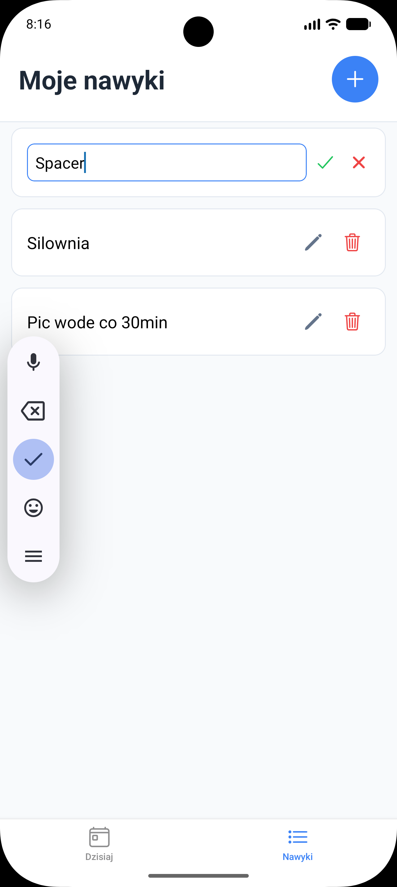
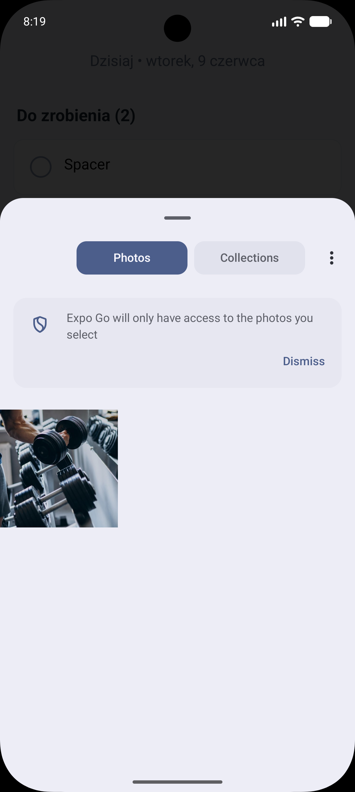

# SimpleHabit – Aplikacja do budowania nawyków

Prosta aplikacja mobilna do śledzenia codziennych nawyków z możliwością dodawania zdjęć wykonanych zadań.

## 🚀 Uruchomienie projektu

1. Sklonuj repozytorium:
   ```bash
   git clone <link-do-twojego-repo>
   cd habit-tracker
   ```

2. Zainstaluj zależności:
   ```bash
   npm install
   ```

3. Uruchom aplikację:
   ```bash
   npx expo start
   ```
   Naciśnij **a** (Android) lub **i** (iOS), jeśli korzystasz z emulator.
   Albo zeskanuj kod qr.

## 🛠 Użyte technologie

- React Native + Expo SDK 54
- Expo Router (Tabs + Stack)
- Context API + AsyncStorage
- expo-image-picker (kamera + galeria)
- expo-file-system (trwałe przechowywanie zdjęć)
- TypeScript

## 📱 Funkcjonalności

- Dodawanie, edytowanie i usuwanie nawyków
- Oznaczanie nawyków jako wykonane dzisiaj
- Dodawanie zdjęcia przy oznaczaniu nawyku (kamera lub galeria)
- Automatyczny reset listy co nowy dzień
- Praca w trybie offline

## 📸 Screenshoty / GIFy

### Zakładka "Dzisiaj"


### Zakładka "Nawyki"


### Dodawanie zdjęcia do nawyku


## 🏗 Budowanie aplikacji (EAS Build)

Budowanie wersji preview APK na Android odbywa się za pomocą EAS Build.

**Wymagania wstępne:**
1. Konto na [expo.dev](https://expo.dev) (darmowe)
2. Zaloguj się: `npx eas-cli login`

**Komenda budowania:**
```bash
eas build --platform android --profile preview
```

Po zakończeniu buildu na serwerach Expo otrzymasz link do pobrania pliku `.apk`.

